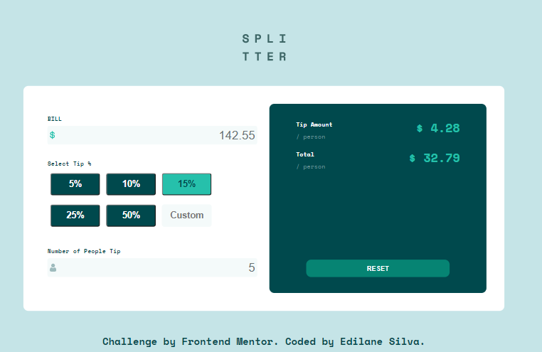
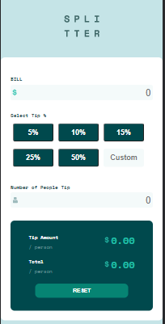

# Tip calculator app 
<h4 align="center"></h4>

## Table of contents

-   [Overview](#overview)

    -   [The challenge](#the-challenge)
    -   [Screenshot](#screenshot)

## Overview

### The challenge

Users should be able to:

-   View the optimal layout for the app depending on their device's screen size
-   See hover states for all interactive elements on the page
-   Calculate the correct tip and total cost of the bill per person

### Screenshot

### Built with

-   Semantic HTML5 markup
-   CSS custom properties
-   Flexbox
-   desktop-first workflow
-   [JavaScript](https://developer.mozilla.org/pt-BR/docs/Web/JavaScript) - JS vanilla

## Author

-   Website - [Add your name here](https://www.your-site.com)
-   Frontend Mentor - [@yourusername](https://www.frontendmentor.io/profile/yourusername)

